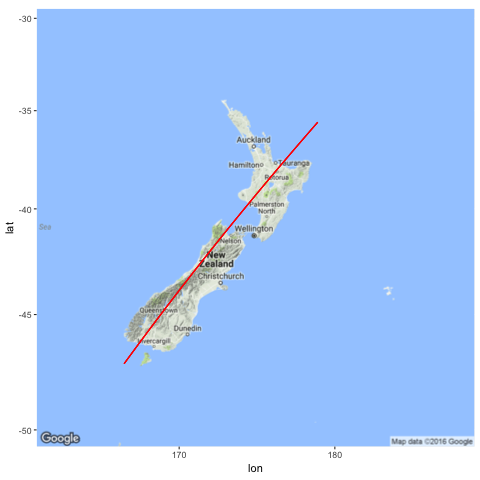

There have been a number of interesting visualisations of this weeks earthquakes: I
particularly like [Chris McDowall's](http://thespinoff.co.nz/science/15-11-2016/878-quakes-in-24-hours-how-new-zealand-shook-after-the-kaikoura-eqnz/),
but also [Harkanwal Singh's](https://twitter.com/kamal_hothi/status/797921821630705664).
Most of them focus on the two-dimensional geographic dimensions, which is important. A
notable exception is the [pie graph showing](http://ellisp.github.io/blog/2016/11/15/piecharts)
that nearly half of the energy released by NZ earthquakes in seven years came on Monday.

I haven't seen anything yet that gives a closer look at the depths of these earthquakes.
The depth of the epicentre has an effect on the energy and damage at the surface, so
this seems like an important factor. Some use colour to indicate depth, but it's hard
to get a feel for the distribution and variation. I thought it would be interesting to take
a look at the quakes with depth as the primary dimension.

```{r setup, include=FALSE, message=FALSE, warning=FALSE}
knitr::opts_chunk$set(eval = FALSE)
```

```{r init}
library(readr)
library(tibble)
library(dplyr)
library(purrr)
library(lubridate)
library(ggplot2)
library(ggthemes)
library(gganimate)
library(ggmap)
library(png)
```


Geonet lets us 
[search and download](http://quakesearch.geonet.org.nz) earthquake data.^[And
provides excellent [live notifications](htts://twitter.com/geonet).]

```{r nov14data}
eqnz_raw <- 
  # Sun 13 to Thu 17 November, but time stored in UTC
  #read_csv("http://quakesearch.geonet.org.nz/csv?bbox=163.60840,-49.18170,182.98828,-32.28713&minmag=2&startdate=2016-11-12T11:00:00&enddate=2016-11-17T11:00:00")
  read_csv("data/earthquakes-2016-11-13--17.csv") %>% 
  mutate(origintime = with_tz(origintime, "Pacific/Auckland"))
```

If depth is your primary dimension then you're probably going to have to give up your standard
2d geography. I picked a line bisecting the South Island as well I could (manually chosen in
Google Maps --- nothing special about it) that could serve as a reasonable 1d projection.

```{r projectionmap, eval=FALSE}
nzsw_long <- 166.46484
nzsw_lat <- -47.18971
nzne_long <- 178.90136
nzne_lat <- -35.60371

png(filename = "images/nz_projection_line.png")
ggmap::get_map("New Zealand", zoom = 5) %>% 
  ggmap::ggmap() +
  coord_map() +
  geom_segment(x = nzsw_long, xend = nzne_long,
               y = nzsw_lat,  yend = nzne_lat,
               color = "red")
dev.off()
```



With this we can plot (and animate) the depths. The quakes are plotted every hour,
and faintly remain, to show the cumulative effect. It's hard to get a realistic
comparison of the magnitudes, given that it's an exponential scale, so I've
"highlighted" the larger ones in blue (>5M), green (>6M) and red (>7M).

```{r depthanim, eval=FALSE}
get_projection <- function(my_long, my_lat) {
  t <- 
    ( (my_long - nzsw_long) * (nzne_long - nzsw_long) +
        (my_lat - nzsw_lat) * (nzne_lat - nzsw_lat) ) /
    ( (nzne_long - nzsw_long)^2 + (nzne_lat - nzsw_lat)^2 )
  return(list(
    long = nzsw_long + t * ( nzne_long - nzsw_long ),
    lat = nzsw_lat + t * (nzne_lat - nzsw_lat )
  ))
}


# Take Kaikoura as 0
# https://en.wikipedia.org/wiki/Kaikoura
zero_ll <- get_projection(173.68, -42.40)

get_nz_cross_section <- function(my_long, my_lat) {
  my_proj <- get_projection(my_long, my_lat)
  return(
    sqrt( (my_proj$long - zero_ll$long)^2 + (my_proj$lat - zero_ll$lat)^2 ) *
      if_else(my_proj$lat >= zero_ll$lat, 1, -1)
  )
}

nz_north <- get_nz_cross_section(178.27514, -37.55764)
nz_south <- get_nz_cross_section(166.66809, -46.20644)

landmarks <- 
  tribble(
    ~name, ~long, ~lat,
    "Dunedin", 170.5, -45.867,
    "Christchurch", 172.62, -43.53,
    "Kaikoura", 173.68, -42.40,
    "Wellington", 174.777, -41.289,
    #"Hamilton", 175.283, -37.783,
    "Auckland", 174.74, -36.84,
    "Gisborne", 178.018, -38.6625
  ) %>% 
  mutate(cross_section = get_nz_cross_section(long, lat))


eqnz <- 
  eqnz_raw %>% 
  select(origintime, longitude, latitude, magnitude, depth) %>% 
  mutate(time_bucket = floor_date(origintime, unit = "hours"),
         cross_section = get_nz_cross_section(longitude, latitude)) %>% 
  arrange(origintime, magnitude)

ggeq <- 
  ggplot(eqnz) +
  theme_tufte() +
  scale_y_reverse() +
  # "Land" and town labels
  geom_rect(xmin = nz_south, xmax = nz_north, ymin = 0, ymax = 1, fill = "green") +
  geom_segment(data = landmarks,
               y = 0.2, yend = 2,
               aes(x = cross_section, xend = cross_section)) +
  geom_text(data = landmarks,
            y = 3,
            aes(x = cross_section, label = name)) +
  # Cumulative
  geom_point(aes(x = cross_section, y = depth, size = 2^magnitude,
                 alpha = 0.01, frame = time_bucket, cumulative = TRUE),
             color = "gray") +
  # Highlight 5-7
  geom_point(data = eqnz %>% filter(magnitude >= 7),
             aes(x = cross_section, y = depth, size = 2 * 2^magnitude, frame = time_bucket),
             color = "red") +
  geom_point(data = eqnz %>% filter(magnitude >= 6, magnitude < 7),
             aes(x = cross_section, y = depth, size = 2 * 2^magnitude, frame = time_bucket),
             color = "green") +
  geom_point(data = eqnz %>% filter(magnitude >= 5, magnitude < 6),
             aes(x = cross_section, y = depth, size = 2 * 2^magnitude, frame = time_bucket),
             color = "blue") +
  # As they come
  geom_point(aes(x = cross_section, y = depth, size = 2^magnitude, frame = time_bucket)) +
  #scale_size(range = c(1,30)) + 
  scale_radius(range = c(1, 30)) +
  theme(axis.text.x = element_blank(),
        axis.ticks.x = element_blank(),
        axis.title.x = element_blank(),
        legend.position = "none") +
  labs(caption = "David Friggens [CC-BY] http://david.frigge.nz") +
  ylab("Depth (km)") +
  ggtitle("New Zealand Earthquakes (>M2)")
  

gg_animate(ggeq, 
           interval = 0.8, 
           ani.width = 800, ani.height = 600,
           filename = "images/eqnz_depth.gif")
```


Alternatively, we could look at depth against time.

```{r depthtime, eval=FALSE}
ggeq2 <- 
  ggplot(eqnz) +
  theme_tufte() +
  scale_y_reverse() +
  # Highlight 5-7
  geom_point(data = eqnz %>% filter(magnitude >= 7),
             aes(x = origintime, y = depth, size = 2 * 2^magnitude, frame = time_bucket, cumulative = TRUE),
             color = "red") +
  geom_point(data = eqnz %>% filter(magnitude >= 6, magnitude < 7),
             aes(x = origintime, y = depth, size = 2 * 2^magnitude, frame = time_bucket, cumulative = TRUE),
             color = "green") +
  geom_point(data = eqnz %>% filter(magnitude >= 5, magnitude < 6),
             aes(x = origintime, y = depth, size = 2 * 2^magnitude, frame = time_bucket, cumulative = TRUE),
             color = "blue") +
  # As they come
  geom_point(aes(x = origintime, y = depth, size = 2^magnitude, 
                 frame = time_bucket, cumulative = TRUE)) +
  #scale_size(range = c(1,30)) + 
  scale_radius(range = c(1, 30)) +
  theme(legend.position = "none") +
  labs(caption = "David Friggens [CC-BY] http://david.frigge.nz") +
  ylab("Depth (km)") + xlab("") +
  ggtitle("New Zealand Earthquakes (>M2)")

gg_animate(ggeq2, 
           interval = 0.2, 
           ani.width = 800, ani.height = 600,
           filename = "images/eqnz_depth_time.gif")
```


In both these plots you can see that not much was happening on Sunday, but
we started getting pummelled by quakes from midnight, Monday morning. (Two minutes
past midnight, to be specific --- I remember it well!) A few are quite deep down,
but most --- especially the big ones --- are relatively shallow. 


## Code unlisting {.appendix}

The code for the animations can be found in the Rmd source in the repository, but
[`gganimate`](http://github.com/thomasp85/gganimate) has changed considerably since
I made these so I wouldn't use them as a guide.
