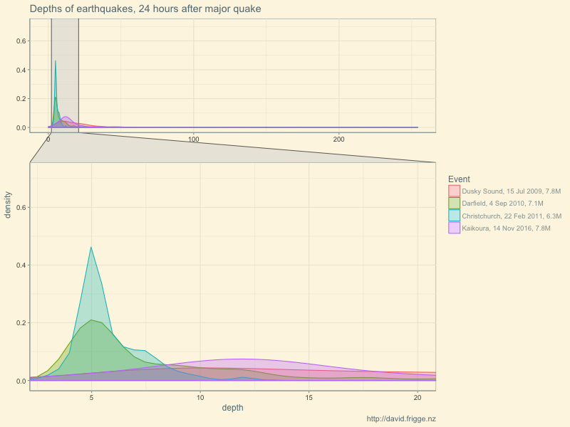

After my [first foray into earthquake data](../2016-11-earthquake-depth/) I poked around a bit more
but didn't produce anything hugely revelatory. I thought I'd use the data though as an excuse to try
out a couple of new things: zooming facets in `ggplot2`, and creating maps with Plotly.

If you are interested in more earthquake insights specifically, two of my favourite visualisations
on the matter have been:

* Sarah Habershon's [connected plot and map in d3](http://optimalbi-aws-nz-play-earthquakeblog.s3-website-ap-southeast-2.amazonaws.com/) (see also explanatory posts [one](http://optimalbi.com/blog/2016/11/25/oh-these-shaky-isles/) and [two](http://optimalbi.com/blog/2016/12/02/drop-cover-hold-how-i-made-my-shaky-isles-visualisation/)), and
* Stefan Marks' [3d visualisation of a century of quakes (YouTube)](https://www.youtube.com/watch?v=ciIvHP0qkis).

## Quake patterns differ, or, How to zoom a facet

It was interesting to look at the [depths of the recent earthquakes](../2016-11-earthquake-depth/),
but it did leave me wondering if these were typical. Are NZ quakes typically distributed like this?
Were the last canterbury quakes this shallow?

I plotted the distributions of the first 24 hours of quakes following four major events in recent
years. It was interesting to see that there was some difference between them. Frustratingly,
most of the quakes were relatively shallow, but there were a few very deep ones. Do you leave in all
the data to show the full range but make the detail hard to see, or crop the tail to tradeoff against
better visibility of the peaks?
Enter `facet_zoom` from the new
[ggforce](https://github.com/thomasp85/ggforce) package, which allows us to see the whole graph,
but also zoom in on the detail of interest.




### Code listing

```{r density, message=FALSE, warning=FALSE, eval=FALSE, echo=TRUE}
library(readr)
library(purrr)
library(dplyr)
library(magrittr)
library(forcats)
library(ggplot2)
library(ggthemes)
library(ggforce)

list(
  #"http://quakesearch.geonet.org.nz/csv?bbox=163.60840,-49.18170,182.98828,-32.28713&minmag=2&startdate=2009-07-15T9:00:00&enddate=2009-07-16T9:00:00",
  "data/earthquakes-2009-07-15.csv",
  #"http://quakesearch.geonet.org.nz/csv?bbox=163.60840,-49.18170,182.98828,-32.28713&minmag=2&startdate=2010-09-03T16:00:00&enddate=2010-09-04T16:00:00",
  "data/earthquakes-2010-09-04.csv",
  #"http://quakesearch.geonet.org.nz/csv?bbox=163.60840,-49.18170,182.98828,-32.28713&minmag=2&startdate=2011-02-21T23:00:00&enddate=2011-02-22T23:00:00",
  "data/earthquakes-2011-02-22.csv",
  #"http://quakesearch.geonet.org.nz/csv?bbox=163.60840,-49.18170,182.98828,-32.28713&minmag=2&startdate=2016-11-13T11:00:00&enddate=2016-11-14T11:00:00"
  "data/earthquakes-2016-11-14.csv"
) %>% 
  map(read_csv) %>% 
  map(filter, eventtype == "earthquake" | is.na(eventtype)) %>% 
  map(select, depth) %>% 
  map2_df(
    list(
      "Dusky Sound, 15 Jul 2009, 7.8M",
      "Darfield, 4 Sep 2010, 7.1M",
      "Christchurch, 22 Feb 2011, 6.3M",
      "Kaikoura, 14 Nov 2016, 7.8M"
    ),
    function(df, ch) {
      df %>%
        mutate(Event = ch)
    }
  ) ->
eq_24h

png("images/eqnz_depth_comparison.png", width = 800, height = 600)
ggplot(eq_24h %>% mutate(Event = fct_inorder(Event)), 
       aes(x = depth, colour = Event, fill = Event)) + 
  geom_density(alpha = 0.3) + 
  facet_zoom(x = depth <= 20 & depth >= 3) +
  theme_solarized() +
  labs(title = "Depths of earthquakes, 24 hours after major quake",
       caption = "http://david.frigge.nz")
dev.off()
```

Notes on the code:

* We include blank event types, as these are probably earthquakes. See the [Geonet docs](http://info.geonet.org.nz/display/appdata/Catalogue+Output), and [Peter Ellis's post](http://ellisp.github.io/blog/2016/11/19/earthquakes) for the result of filtering them out.
* I'm enjoying using [purrr](https://github.com/hadley/purrr) more and more. Creating lists and mapping across them is starting to feel more natural to me.
* The events will be ordered alphabetically unless we turn them into a factor (yay for [forcats](https://blog.rstudio.org/2016/08/31/forcats-0-1-0/)).
* `facet_zoom` is fairly straightforward, which is nice.


## Big quakes are (almost) everywhere, or, Scatter plots on maps with Plotly

I've "always" known that Wellington was the big risk for quakes, and has had some big ones
in the past. And I grew up in Hawkes Bay with the communal memory of the 1931 quake there.
But have the big quakes been only in these regions or have they been across the whole country?

I looked at Geonet for all recorded quakes over 7 magnitude; it turns out there have been 30
of them. As you can see below, the quakes span the length of the country, on what looks like
a diagonal line, highlighting [New Zealand's position](https://en.wikipedia.org/wiki/Geology_of_New_Zealand)
as the meeting place of the Pacific and Australian Plates.
Northland looks like the place to be if you're super scared of earthquakes. Just keep your
fingers crossed that [Auckland's volcanoes](https://en.wikipedia.org/wiki/Auckland_volcanic_field)
don't explode!

I've plotted the 30 big quakes, coloured by date.
For reference, especially for non-kiwis, I've also plotted the main towns and cities,
scraping this data from Wikipedia.

```{r bigguns, message=FALSE, warning=FALSE, layout="l-page", fig.height=7}
library(readr)
library(dplyr)
library(plotly)
library(lubridate)
big_eq <- 
  read_csv("data/big_nz_quakes.csv") %>% 
  # read_csv("http://quakesearch.geonet.org.nz/csv?bbox=162.99316,-49.66763,182.37305,-32.91649&minmag=7&startdate=1800-01-01T0:00:00&enddate=2016-12-31T23:00:00") %>% 
  mutate(origintime = with_tz(origintime, "Pacific/Auckland"),
         magnitude = round(magnitude, 1),
         depth = round(depth, 0),
         Year = year(origintime))

nzua <- read_tsv("data/nz_urban_areas.tsv", skip = 1, col_types = "icccnn")

plot_geo(big_eq, 
         lat = ~latitude, lon = ~longitude) %>% 
  add_markers(text = ~paste0(format(origintime, "%l:%M%p, %A %e %B %Y"), "<br />",
                             magnitude, " ", magnitudetype, ", ", depth, "km deep"),
              size = I(10),
              marker = list(sizemode = 'diameter'),
              color = ~Year,
              name = "Earthquakes",
              hoverinfo = "text") %>% 
  add_markers(data = nzua %>% rename(latitude = Latitude, longitude = Longitude),
              size = I(5),
              marker = list(sizemode = 'diameter'),
              color = I("black"),
              text = ~paste0(Name, " Urban Area <br /> Population ", Population),
              hoverinfo = "text",
              name = "Urban areas",
              showlegend = T) %>%
  layout(title = "Big quakes (>7M) in New Zealand",
         geo = list(scope = "world",
                    showland = TRUE,
                    resolution = 50,
                    projection = list(
                      type = "conic conformal",
                      rotation = list(lon = 172)
                    ),
                    lonaxis = list(range = c(156,190)),
                    lataxis = list(range = c(-50,-33))))
```


### Code listing

```{r ref.label='bigguns', echo = T, eval = F}
```

Notes on the code:

* [Lubridate](https://github.com/hadley/lubridate) is great for processing dates; `with_tz` allows easy conversion from UTC. I had thought that `stamp` might allow me easy display formatting, but I couldn't get it to work sensibly so reverted to `format`.
* I considered sizing the points based on magnitude, but it didn't work when I added the second trace. I figured it didn't add a lot to the "story" so didn't bother pursuing it.
* ~~Frustratingly, I didn't figure out how to make the map bigger. Both the knitr `fig.height` option, and the height option in Plotly's `layout` function made the figure area bigger, but not the box with the map in.~~ **Nov 2018:** This seems to work better now, but I'm not sure whether it's changes in Plotly, or due to the switch to Radix for publishing.
* **Nov 2018:** In recompiling this code, the markers (nearly) all disappeared. I had set the sizing to diameter, as per [issue 1133](https://github.com/ropensci/plotly/issues/1133).

On the whole, I'm not entirely happy with this. If I'd had more time I'm sure I would have thought more
about the design, and hopefully solved all of the  technical issues I ran in to.
It was interesting to try out Plotly's mapping capabilities, but next time I think I'll reach for
[leaflet](https://rstudio.github.io/leaflet/) first.


