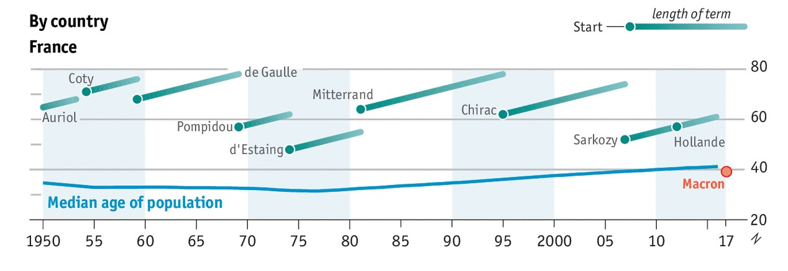

```{r setup, include=FALSE}
knitr::opts_chunk$set(echo = FALSE)
knitr::opts_chunk$set(message = FALSE)
knitr::opts_chunk$set(warning = FALSE)
```

When [Emmanual Macron](https://en.wikipedia.org/wiki/Emmanuel_Macron) was (about to be) elected president of France
it was notable that he was relatively young --- both the youngest president since
1848, and the first to be younger than the median age of the country.
_The Economist_ noted that there seems to be a trend for Western leaders to
be getting younger whilst their populations age, and produced some nice
graphs showing the data for France, Britain, Germany and USA.

<aside>
Click through for the full graphic with the other three countries.
</aside>

{width=100% .external}


### New Zealand Prime Ministers

New Zealand got its own young and exciting leader last year in Jacinda Ardern.
How uncharacteristic is her "youth"^[I don't feel especially young these days,
and certain things make me feel particularly old, so having big news stories
fizzing with excitement about how someone my age is unbelievably young is nice.]
for New Zealand?

```{r nzpm_data, eval = FALSE}
library(magrittr)
library(readr)
library(dplyr)
library(rvest)
read_html("https://en.wikipedia.org/wiki/List_of_Prime_Ministers_of_New_Zealand_by_age") %>% 
  html_node("table") %>% 
  html_table() %>% 
  filter(`Prime Minister` != "Prime Minister") %>% # header at end
  transmute(
    first_name = str_replace(`Prime Minister`, '([- A-Za-z]+), ([- A-Za-z]+)\\2 \\1', '\\2'),
    last_name = str_replace(`Prime Minister`, '([- A-Za-z]+), ([- A-Za-z]+)\\2 \\1', '\\1'),
    birth_date = substring(`Date of birth`, 1, 10) %>% ymd(),
    age = substring(`Age at beginning of(first) term`, 1, 2) %>% as.integer(),
    start_date = `Start date of(first) term` %>%  str_replace('.*\\(([0-9-]+)\\)', '\\1') %>% ymd(),
    end_date = `End date of(final) term` %>% str_replace('\\[[0-9]+\\]', '') %>% str_replace('.*\\(([0-9-]+)\\)', '\\1') %>% ymd()
  ) %>% 
  write_csv("data/nzpm.csv")

```

```{r nzpm, fig.height=3, fig.width=7, out.width='100%', preview = TRUE}
library(readr)
library(dplyr)
library(lubridate)
library(ggplot2)
library(xkcd)

nzpm <- 
  read_csv("data/nzpm.csv") %>% 
  filter(start_date > ymd("1949-12-01")) %>% 
  mutate(end_date = if_else(is.na(end_date), today(), end_date),
         start_age = interval(birth_date, start_date) / years(1),
         end_age = interval(birth_date, end_date) / years(1)) %>% 
  # Remove Holyoake's first brief stint
  filter(!(last_name == "Holyoake" & start_age < 54))
nz_pop <-
  read.csv("data/nzpop.csv", skip = 4) %>% 
  mutate(year = year %>% paste0("-06-30") %>% ymd())

ggplot(nzpm) +
  geom_segment(aes(x = start_date, xend = end_date,
                   y = start_age, yend = end_age)) +
  geom_point(aes(x = start_date, y = start_age)) +
  geom_line(data = nz_pop,
            aes(x = year, y = median_age),
            color = "blue") +
  geom_text(aes(x = start_date, y = start_age,
                label = last_name),
            hjust = 1, vjust = 1, family = "xkcd") +
  annotate("text", x = ymd("1959-01-01"), y = 22, color = "blue",
           label = "Median age of population", family = "xkcd") +
  scale_y_continuous("Age", breaks = seq(20, 80, 10), limits = c(20, 80)) +
  scale_x_date("Year", breaks = floor_date(nzpm$start_date, unit = "year"), date_labels = "%y") +
  labs(title = "Age of New Zealand Prime Ministers",
       caption = "david.frigge.nz") +
  theme_xkcd()
```

There does seem to be a general downwards trend (reminding me of
[Simpson's paradox](https://en.wikipedia.org/wiki/Simpson%27s_paradox)), but
there does seem to be a clear "generational" jump.
Despite being younger than Macron, Ardern just misses out on being under the
median age (though not [for women](https://www.stats.govt.nz/news/more-women-are-over-30-and-more-men-are-under-30)).


### Notes

* Rather than spending much more time trying to replicate _The Economist_'s style,
I thought I'd head in the other direction and replicate [XKCD](https://xkcd.com) (there's an
[R package for that](https://cran.r-project.org/web/packages/xkcd/index.html)).
* The labels are mostly not too bad, but would need manual placement for better
effect ([ggrepel](https://cran.r-project.org/web/packages/ggrepel/index.html) doesn't help here).
* I thought that putting the change years on the x axis rather than regular 
breaks highlights the times between changes, though some of them overlap.

#### Edit

Thanks to Paul Murrell for [pointing out](https://github.com/dakvid/dakvid.github.io/issues/1)
that I had a glaring issues of [Nash](https://en.wikipedia.org/wiki/Walter_Nash)
and [Holyoake](https://en.wikipedia.org/wiki/Keith_Holyoake) appearing to share
power for three years. I'd missed that Holyoake became PM two months before
the 1957 election, which he lost, before beating Nash in 1960.
I manually fixed the underlying data (Wikipedia only lists the dates of first
entering office and last leaving, rather than all separate terms), but have
filtered out the two month stint to reduce clutter in the graph.

As an aside, this issue of repeating prime ministers is one reason why I didn't
try to produce the same graph for Australia. At least there is
[a Twitter feed](https://twitter.com/whoispm) that gives good granularity.

## Data {.appendix}

* New Zealand Prime Ministers: [nzpm.csv](data/nzpm.csv)
* New Zealand population median: [nzpop.csv](data/nzpop.csv)

## Code listing {.appendix}

```{r ref.label=c('nzpm_data', 'nzpm'), echo=T, eval = F}
```

