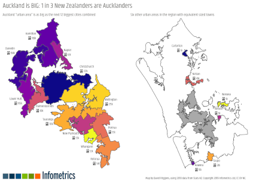

```{r setup, include=FALSE}
knitr::opts_chunk$set(echo = TRUE)
```

Sometimes it's only when you directly compare populations that you realise just how big
(or small) some places are. And maps can make it fun. Did you know that you can
[fit over 30 US cities within Greater Tokyo](http://metrocosm.com/how-many-u-s-cities-can-you-fit-inside-tokyo/),
[fit the next 6 biggest countries within India](https://www.reddit.com/r/IndiaSpeaks/comments/9vt9gw/oc_fitting_the_next_six_most_populated_countries/), or
[fit the next 12 biggest New Zealand cities within Auckland](http://www.infometrics.co.nz/chart-month-auckland-big/)?

I discovered that last fact whilst playing around with population and boundary
data for the new [Statistical standard for geographic areas 2018](http://archive.stats.govt.nz/methods/classifications-and-standards/classification-related-stats-standards/geographic-areas.aspx)
from Stats NZ, particularly the _urban/rural_ areas and the small _Statistical Area 2_
(SA2) areas. I made the map at work for our monthly newsletter and it generated
a bit of interest, accounting for 45% of the web traffic to our main website in
the following couple of days. It also got picked up by the main news sites and
was still "trending" on the front pages of 
[NZ Herald](https://www.nzherald.co.nz/nz/news/article.cfm?c_id=1&objectid=12262914),
[Newshub](https://www.newshub.co.nz/home/new-zealand/2019/08/auckland-s-population-compared-with-the-rest-of-nz-in-stunning-new-map.html) and
[Stuff](https://www.stuff.co.nz/national/115352173/mapgate-new-auckland-map-shows-off-regions-comparable-size-to-12-largest-regions)
two days later. There goes my 15 minutes.

<aside>
```{r info_thumb, echo=FALSE}

```
Good thing I didn't just hide it away on this blog.
</aside>

Today I thought I'd build up a simpler map to demonstrate the process in R.
Whilst the other map looked at the urban areas within the Auckland region and
compared them to other cities and towns around the countries, this one will look
at the whole Auckland region.
You can comfortably fit the next three largest regions --- Canterbury, Wellington,
and Waikato --- and still have 80,000 people left over, roughly the same as
urban Palmerston North city.

<object type="image/svg+xml" data='images/auckland.svg' width='100%'></object>


## Building the map

First, let me be honest that I'm only going to talk about the easy stuff:
making the map in R. If you want to create a set of custom areas to make
a different map then I don't have any shortcuts or specific advice except to
set aside more time than you expect, and have fun.

With that out of the way, let's load the R packages needed.

```{r packages}
library(magrittr)
library(tibble)
library(readr)
library(dplyr)
library(purrr)
library(sf)
library(rmapshaper)
library(ggplot2)
library(leaflet)
library(htmltools)
library(viridis)
library(cowplot)
library(svglite)
library(emo)
```


### Population data

If you go to [NZ.Stats](http://nzdotstat.stats.govt.nz) you can get population
estimates at various geographic levels (just be careful of the difference between
2017 and 2018 boundaries). Downloading data for regional councils (RC) I could
see that _Auckland > Canterbury + Wellington + Waikato_. The excess could have
been filled with two small councils, but to keep it simpler I chose the closest
matching urban area from the urban rural series: Palmerston North.

<aside>
All population data used here is for the 2018 estimate, currently the most
recent available.
</aside>

Downloading the SA2 series and filtering only those in Auckland, I grouped the
SA2s into four contiguous areas that correspond to the populations of the four
areas above. [Here's one I prepared earlier.](data/big_regions.csv)

I'm afraid I don't have any fancy technique to make this easy, there's a fair bit
of manual graft involved. I used the [local boards](https://www.aucklandcouncil.govt.nz/about-auckland-council/how-auckland-council-works/local-boards/all-local-boards/Pages/default.aspx)^[Unfortunately
the local boards don't line up with the SA2 boundaries, but they were close
enough for this.]
to make a simpler starting point, but then it was manually shuffling SA2s
back and forth across boundaries until everything worked. The SA2 populations
generally range between 1,500 and 6,000 so are quite fine-grained from the
perspective of the large regions two orders of magnitude higher. But they are
quite coarse when you're trying to manipulate a border to maintain area populations +/- 500 from
the comparison regions. For this reason some of the borders in the urban area
map are less smooth than I would have liked --- I probably could have done
better if I'd spent even more time considering other configurations, or had
dropped down to the even smaller Statistical Area 1 areas.

Here's how the mapping works out, splitting up Auckland's population of
1,694,650. It's a bit rough --- the urban area map was much tighter ---
but it's close enough for today.^[This mapping is from some earlier
exploratory work that led to the published graphic, but I don't have the
time today to try and improve it for the post.]

```{r pop_table, echo=FALSE, eval=TRUE}
pop_summary <- tribble(
  ~Area, ~`Real Population`, ~`Auckland Share`,
  'Canterbury Region', 624200, 622210,
  'Wellington Region', 521500, 523230,
  'Waikato Region', 468800, 468160,
  'Palmerston North', 80280, 81050)
knitr::kable(pop_summary)
```


### Geographical data

You can find boundary files for SA2s at
[Stats NZ's Datafinder](https://datafinder.stats.govt.nz/layer/92213-statistical-area-2-2018-clipped-generalised/).
I downloaded^[I used the 2018 boundary files because that's what data was provided for.
There are 2019 boundary files that split a couple of SA2s and will be preferable
in future. These things exist to make sure you're paying attention.] them as gpkg
(not [shapefile](http://switchfromshapefile.org/), especially if you like macrons).
Stats NZ also provides [geographic concordances](http://archive.stats.govt.nz/browse_for_stats/Maps_and_geography/Geographic-areas/geographic-area-files.aspx)
so we can see which SA2s are in Auckland.
With the `sf` package and the tidyverse it's easy to combine with the mapping
to group the SA2s into our new boundaries.


```{r boundaries_sa2, eval=FALSE}
# from Datafinder
sa2 <-
  read_sf("data/statistical-area-2-2018-clipped-generalised.gpkg") %>% 
  select(
    code = SA22018_V1_00,
    name = SA22018_V1_00_NAME
  ) %>% 
  mutate(code = as.integer(code))

# from concordance page
concordance <-
  read_tsv("data/Annual Areas 2018.txt")
names(concordance)[23] <- "REGC2018_code" # some sort of encoding error?
names(concordance)[24] <- "REGC2018_name"
names(concordance)[25] <- "CON2018_code"
names(concordance)[26] <- "CON2018_name"
concordance %<>%
  filter(TA2018_name == "Auckland") %>% 
  select(
    code = SA22018_code,
    name = SA22018_name
  ) %>% 
  distinct()

sa2 %<>%
  semi_join(concordance, by = "code")

# from NZDotStat, only 2018 and total age/sex exported
population <-
  read_tsv("data/TABLECODE7980_Data.csv") %>% 
  select(
    code = AREA,
    population = `Value  Flags`
  )

sa2 %<>%
  inner_join(population, by = "code")

sa2 %<>%
  st_transform(crs = "+proj=longlat +datum=WGS84") %>%  # needed for leaflet
  ms_simplify(keep = 0.4, keep_shapes = TRUE)    # don't need full detail
```
```{r boundaries_read, eval=TRUE, echo=FALSE}
sa2 <- readRDS("data/sa2.rds")
```
```{r boundaries_join}
mapping <-
  read_csv("data/big_regions.csv") %>% 
  filter(code != 111800) # Barrier Islands, for a more compact map

custom_areas <-
  sa2 %>% 
  inner_join(mapping, by = c("code", "name")) %>% 
  group_by(Area) %>% 
  summarise(map_population = sum(population)) %>% 
  ungroup()
```


### Leaflet

Now that we've got boundary data it's straightforward to throw something
together quickly with Leaflet. This wasn't my final goal --- I needed a
static image --- but I found a dynamic map to be very helpful in the iterative
process of creating the SA2 mapping earlier.

```{r leaflet, fig.height=4}
actual_pop <-
  tribble(
    ~Area, ~`Real Population`,
    'Canterbury Region', 624200,
    'Wellington Region', 521500,
    'Waikato Region', 468800,
    'Palmerston North', 80280
  )

map_colours <-
  colorFactor(topo.colors(4),
              custom_areas$Area)

leaflet(width = "100%", height = "800px") %>% 
  addTiles() %>% 
  addPolygons(
    data = custom_areas %>% 
      inner_join(actual_pop, by = "Area"),
    opacity = 1, color = "black", weight = 1,
    fillOpacity = 0.8,
    fillColor = ~map_colours(Area),
    label = ~paste0("<b>", Area, "</b>, ", prettyNum(`Real Population`, big.mark = ","), " people<br>",
                    "Map shows ", prettyNum(map_population, big.mark = ","), " people") %>% 
              map(HTML)
  )
```


### ggplot2

It's also  straightforward at this point to create a static image with
`ggplot2`, though it's not very pretty and could do with some annotations.

```{r ggdefault}
ggplot() +
  geom_sf(data = custom_areas,
          aes(geometry = geom,
              fill = Area))
```

We can dress this up with a few tweaks. We'll use `cowplot`'s map theme, as I
did for the urban area map, but I can also recommend stealing the stunning
[theme from Timo Grossenbacher](https://timogrossenbacher.ch/2019/04/bivariate-maps-with-ggplot2-and-sf/).

```{r ggpretty, fig.width=8, fig.height=11}
ggplot() +
  scale_fill_viridis(discrete = TRUE, option = "C") +
  geom_sf(data = custom_areas,
          aes(geometry = geom,
              fill = Area)) +
  theme_map() +
  theme(legend.position = "none") +
  labs(title = "Auckland region is bigger than the next 3 biggest regions",
       caption = "https://david.frigge.nz")

```

If you want to put labels on then it gets fiddly with manual trial-and-error
I'm afraid. Guessing and adjusting the locations may not be the best approach,
but it's what I used. Note that exact locations that work best depend on the
size of your output file.

```{r ggannotate, eval=FALSE}
map_font_family <- "Chilanka" 
# hack from Peter Ellis added manually afterwards
# see http://freerangestats.info/blog/2019/04/07/fonts-and-stuff

label_data <-
  tribble(
  ~Area,          ~Population,  ~Long,   ~Lat, ~Hjust, ~Arr_long, ~Arr_lat,
  'Canterbury Region', 624200, 174.38, -36.78,      1,        NA,       NA,
  'Wellington Region', 521500, 174.46, -37.08,      1,    174.72,   -36.90,
  'Waikato Region',    468800, 174.59, -37.22,      1,        NA,       NA,
  'Palmerston North',   80280, 174.84, -36.69,      0,    174.82,   -36.86
  ) %>% 
  mutate(label = paste0(Area, "\n",
                        emo::ji("couple"), " ",
                        round(Population / 1000, 0), "k"))

auckland_plot <-
  ggplot() +
  scale_fill_viridis(discrete = TRUE, option = "C") +
  geom_sf(data = custom_areas,
          aes(geometry = geom,
              fill = Area)) +
  geom_text(data = label_data,
            aes(label = label,
                x = Long,
                y = Lat,
                hjust = Hjust),
            size = 3,
            family = map_font_family) +
  geom_curve(data = label_data %>% filter(!is.na(Arr_long)),
             aes(x = Long,
                 y = Lat,
                 xend = Arr_long,
                 yend = Arr_lat),
             curvature = 0.1,
             size = 0.2,
             arrow = arrow(length = unit(0.005, "npc"))) +
  theme_map() +
  theme(legend.position = "none",
        text = element_text(family = map_font_family)) +
  labs(title = "Auckland region is bigger than the next 3 biggest regions",
       caption = "https://david.frigge.nz")

svglite(file = "images/auckland.svg",
        width = 8,
        height = 11)
print(auckland_plot)
dev.off()
```

And that's the final image you see at the top of the page (along with the
[hack](http://freerangestats.info/blog/2019/04/07/fonts-and-stuff) for the
Google font).


# Data {.appendix}

* Grouping of SA2s in the four areas: [big_regions.csv](data/big_regions.csv)
* Auckland SA2 boundaries and populations in sf/tibble: [sa2.rds](data/sa2.rds)

