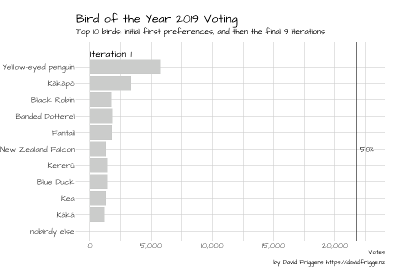

If you've been anywhere near New Zealand Twitter in the past month you will be
well aware of the [Bird of the Year](https://www.birdoftheyear.org.nz/) competition.
If not, feel free to read up on [Wikipedia](https://en.wikipedia.org/wiki/Bird_of_the_Year).
The good folks at Dragonfly Data Science and Forest and Bird have made the 
[voting data available](https://www.dragonfly.co.nz/news/2019-11-12-boty.html).

There is interesting analysis to be done on the voters and preferences, which
I will leave to [others](https://twitter.com/search?q=%23BirdoftheYear%20thoughtfulnz&src=typed_query),
as I'm more immediately interested in the counting. The election allowed five
preferences to be chosen, with Single Transferable Vote (STV) used for the count.

This is very similar to the local election STV animations I've recently done,
so thought I'd knock up something similar. The full counting would be a bit
infeasible as there were 85 birds, and it took 84 iterations to decide the winner!
So I've limited to the top 10 birds, showing the initial first preferences in
Iteration 1, and then the final 9 iterations.

```{r the_vote}

```

At first glance it seems laughable that there are so many eliminated ballots
by the end. But realising that there are 85 birds in play and you can only rank
five, it's actually quite impressive that half of the voters chose at least
one of the top two.


## Code

Here's the code to produce the animation.
Note that I've only seen the ballot data, not any information about the official
voting details, so the counting here using the `STV` R package may not be
exactly the same. It should be close enough though.

This is much simpler that the other ones I've done --- there's just one step
per iteration. It was fairly straightforward given that experience, though I
thought I'd be able to use `transition_states`; this caused some weird behaviour
though so I switched to `transition_components`.

```{r code, eval=FALSE, echo=TRUE}
library(magrittr)
library(readr)
library(dplyr)
library(forcats)
library(tidyr)
library(STV)
library(ggplot2)
library(gganimate)
library(hrbrthemes)
library(showtext)

font_add_google("Architects Daughter", "ad")
showtext_auto()
DEFAULT_FONT <- "ad"

# one row per ballot, one column per preference
raw_votes <- read_csv("data/BOTY-votes-2019.csv",
                      col_types = "___ccccc")

num_ballots <- nrow(raw_votes)

# one row per ballot, one column per bird
formatted_votes <- 
  bind_rows(
    raw_votes %>% select(bird = vote_1) %>% mutate(pref = 1L, id = row_number()),
    raw_votes %>% select(bird = vote_2) %>% mutate(pref = 2L, id = row_number()),
    raw_votes %>% select(bird = vote_3) %>% mutate(pref = 3L, id = row_number()),
    raw_votes %>% select(bird = vote_4) %>% mutate(pref = 4L, id = row_number()),
    raw_votes %>% select(bird = vote_5) %>% mutate(pref = 5L, id = row_number())
  ) %>% 
  drop_na() %>% 
  spread(bird, pref) %>% 
  select(-id)

# wait a little while for this one
election <- 
  stv(formatted_votes %>% as.data.frame(),  # stv hates tibbles
      seats = 1) %>% 
  extract2("details") %>%
  mutate(ntv = num_ballots - ballots,
         iteration = row_number()) %>% 
  as_tibble()

# I'm having issues with utf8 on Windows, hence the numbers
data_to_plot <- 
  election %>%
  select(iteration, quota, ntv,
         94, # Yellow-eyed penguin
         42, # Kākāpō
         22, # Black Robin
         14, # Banded Dotterel
         32, # Fantail
         55, # New Zealand Falcon
         44, # Kererū
         25, # Blue Duck
         43, # Kea
         41  # Kākā
         ) %>% 
  filter(iteration == 1 | iteration >= 76)

quotas <- 
  data_to_plot %>% 
  select(iteration,
         quota,
         ntv) %>% 
  mutate(iteration_label = paste("Iteration", iteration))

votes <- 
  data_to_plot %>% 
  select(-quota, -ntv) %>% 
  gather("Bird", "Votes", -iteration) %>% 
  mutate(Votes = if_else(Votes == "Eliminated", "0", Votes) %>% as.integer()) %>% 
  bind_rows(
    quotas %>% 
      transmute(iteration,
             Bird = "nobirdy else",
             Votes = ntv)
  ) %>% 
  mutate(Bird = Bird %>% fct_inorder() %>% fct_rev(),
         bar_colour = case_when(Bird == "nobirdy else" ~ "#333333",
                                Bird == "Yellow-eyed penguin" & iteration == max(iteration) ~ "yellow",
                                TRUE ~ "gray80")) %>% 
  arrange(iteration)

num_iterations <- votes %>% pull(iteration) %>% max()
num_iterations_shown <- votes %>% distinct(iteration) %>% nrow()
num_birds <- votes %>% distinct(Bird) %>% nrow()

# to handle transition_components
timeframes <- 
  quotas %>% 
  select(iteration) %>% 
  mutate(timeframe = row_number())
quotas %<>% inner_join(timeframes)
votes %<>% inner_join(timeframes)


bird_plot <- 
  ggplot() +
  theme_ipsum(base_size = 12,
              base_family = DEFAULT_FONT) +
  # draw the bars
  geom_col(data = votes,
           aes(x = Bird, y = Votes, group = Bird, fill = bar_colour)) +
  scale_y_continuous(labels = scales::comma) +
  scale_fill_identity() +
  coord_flip() +
  # label winner
  geom_text(data = votes %>% filter(iteration == num_iterations,
                                    Bird == "Yellow-eyed penguin"),
            aes(x = Bird, group = Bird),
            y = 500,
            label = "WINNER!",
            family = DEFAULT_FONT,
            color = "black",
            hjust = 0
            ) +
  # draw the quota line
  geom_hline(data = quotas, aes(yintercept = quota)) +
  geom_text(data = quotas,
            x = (num_birds + 1) / 2,
            aes(y = quota),
            label = "50%",
            nudge_y = 300,
            family = DEFAULT_FONT,
            color = "black",
            hjust = 0) +
  # header with iterations
  expand_limits(x = num_birds + 1.5) +
  geom_text(data = quotas,
            aes(label = iteration_label),
            x = num_birds + 0.8, y = 0,
            size = 5, fontface = "bold", hjust = 0,
            family = DEFAULT_FONT) +
  # animation controls
  transition_components(timeframe) +
  ease_aes("cubic-in-out") +
  # labels
  labs(x = NULL,
       title = "Bird of the Year 2019 Voting",
       subtitle = "Top 10 birds: initial first preferences, and then the final 9 iterations",
       caption = "by David Friggens https://david.frigge.nz")

bird_gif <- 
  animate(bird_plot,
          fps = 10,
          duration = num_iterations_shown + 6,
          width = 800, height = 560,
          start_pause = 10,
          end_pause = 10)

anim_save("images/boty2019.gif", animation = bird_gif)
```


## Data {.appendix}

[BOTY-votes-2019.csv](data/BOTY-votes-2019.csv)

Copyright [Forest and Bird](https://www.forestandbird.org.nz/), CC-BY 4.0.
Retrieved from [Dragonfly Data Science](https://www.dragonfly.co.nz/news/2019-11-12-boty.html).
Thanks!
