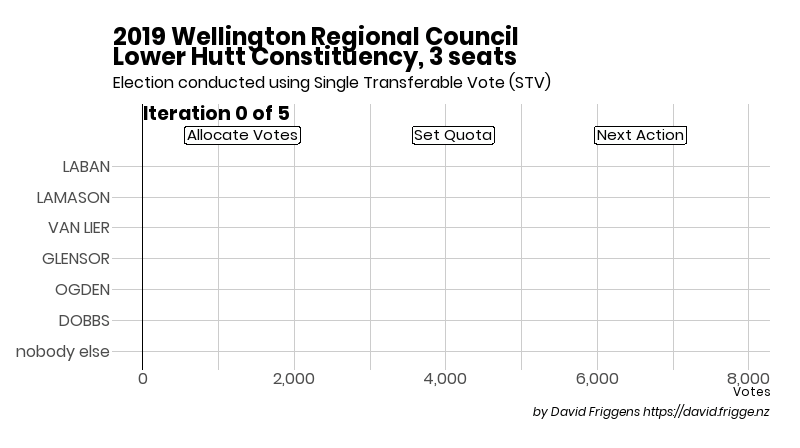

TL;DR --- animations of the 2019 STV local elections are available here:
[STV Elections in New Zealand](https://david.frigge.nz/stvnz/).
The animation of the Lower Hutt regional councillors is below as a teaser.
Below that is a lot of waffle, with no maple syrup. `r emo::ji("smile")`

```{r example}

```

A number of councils in New Zealand, and all of our district health boards,
use single transferable vote (STV) for electing officials every three years.
Voting is fairly straightforward, as you just rank the candidates in order
of preference. Counting the votes is a much more complicated affair, and
understanding how winners and losers were "iterated" out is rather opaque
for most people.
For more on the details, see
[my post from 2016](../2016-11-simple-to-vote/).

Three years ago I thought it would be fun, interesting and useful --- for me
at least, if not others --- to create animated graphs of the counting
process. Explictly showing the redistribution of votes at each iteration as
candidates are elected or excluded makes the process a bit more tangible.
I succeeded in wrangling `gganimate` --- a new R package --- to create them,
but I only published the ones in the post because many of the GIF files were
very large and I didn't have a quick and user-bandwidth-friendly way of
presenting them all at hand. I also wasn't completely happy with some aspects of
the animations, and would have liked to have some sort of user control.
I did look at some JavaScript options but nothing seemed able to do exactly
what I wanted.^[If you have any suggestions, let me know!]

This year I've spent some time re-mastering `gganimate` (which has had a
very comprehensive rewrite) and making the animations a bit more sophisticated.
The key differences are better synchronising the labels for the sub-iteration
steps with the actual actions, and explicitly highlighting the surplus votes
before they're redistributed. I'm planning to write a blog post explaining
my process --- not least because I'll likely have completely forgetten
everything about it in three years' time!

I previously set up a git repository to store the data files and started to
try and make them into a coherant dataset, but that never really went anywhere.
I've started to requisition it now to host a website for displaying the results;
I've solved the hosting problem by creating video files and uploading them to
Vimeo (which unlike YouTube won't stick ads in playback); it also serves
to give some user controls.
The 2019 animations are going up on the site over the next week or so, limited
by my time and Vimeo's constraints on free accounts. After that I'll start
adding 2016 animations and anything older I can get my hands on.

