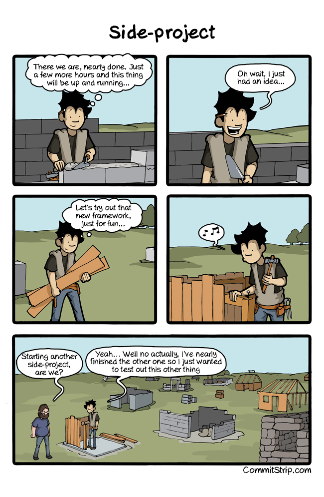

### About Me

I currently find myself working as a data analyst (data scientist?) in the private
sector, after several years in public sector organisations.
My academic background is mathematical logic and theoretical computer science, and I spent some years
working in libraries. Most of my time outside of work is consumed by my young family for now.

I occasionally find time to play around with code and data for my own curiosity,
and having a blog is
proving to be an easy and convenient place to publish things I want to share.
And it also gives me the incentive to stop my ```skunkworks``` folder from looking too much like this:

{width=100% .external}


### Books

A random sample of technical books from my shelves (some of which I have read):

<div id="wa8a9ff5b4082e980f7782e455830f1b9"></div><script type="text/javascript" charset="UTF-8" src="https://www.librarything.com/widget_get.php?userid=dakvid&theID=wa8a9ff5b4082e980f7782e455830f1b9"></script><noscript><a href="http://www.librarything.com/profile/dakvid">My Library</a> at <a href="https://www.librarything.com/catalog/dakvid/technicalmathematics%252Fcomputers">LibraryThing</a></noscript>


### Contact

Preferred comments/contact is via [Twitter](https://twitter.com/dakvid).
Alternatively, you can reach me by changing a dot to an @ in the domain.


### Disclaimer

Nothing in here is my own view, but was forced upon me at gunpoint by my wife.
(Apologies to [Peter Gutmann](https://www.cs.auckland.ac.nz/~pgut001/).)

More seriously, this site is entirely personal --- any views are nothing to do with any previous, current, or future employers.


### Colophon

The blog is written in R markdown, produced with the
[Radix](https://github.com/rstudio/radix) R package
(itself based on [distill](https://github.com/distillpub)), and
hosted on [GitHub Pages](https://pages.github.com).

